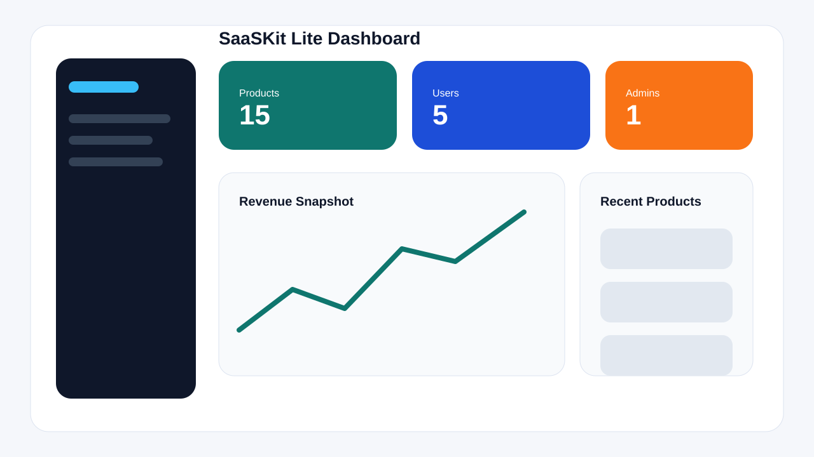
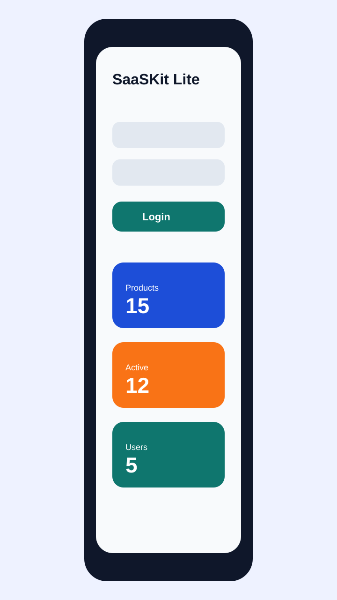

# SaaSKit Lite

[](https://laravel.com/)
[](./LICENSE)
[](./VERSION)

Lightweight, developer-friendly SaaS starter kit for real-world applications.

SaaSKit Lite exists to give teams a clean starting point for SaaS products, admin panels, and API-first systems without the usual starter-kit tradeoff between "too bare to matter" and "too heavy to adapt". It keeps the implementation simple, but the repository structure, API behavior, and documentation are shaped like a project you could actually extend in production.

## Version

`v1.0.0`

## Why This Exists

- Many starter kits solve the first 10 minutes, but not the first 10 weeks.
- SaaSKit Lite focuses on the practical baseline most teams need first: auth, roles, modular CRUD, consistent API responses, and maintainable architecture.
- The project is designed to be a foundation for real SaaS work, not a tutorial-only code dump.

## Highlights

- Laravel 11 API backend in `backend/`
- Laravel Sanctum authentication with register, login, logout, and `me`
- Role-based access control with `admin` and `user`
- Dashboard stats endpoint with role-aware output
- Product CRUD with pagination and filtering
- Controller -> service -> repository architecture
- Standardized JSON success, error, and pagination responses
- Deterministic demo seeders and API tests
- Optional Flutter starter in `mobile/`
- Postman collection and API docs in `docs/`

## Tech Stack

| Layer | Stack |
| --- | --- |
| Backend | Laravel 11, PHP 8.2+, Sanctum |
| Database | MySQL 8.x |
| Auth | Laravel Sanctum |
| Testing | PHPUnit |
| Mobile | Flutter 3.x starter |

## Repository Structure

```text
saaskit-lite/
+-- backend/
|   +-- app/
|   |   +-- Http/
|   |   +-- Models/
|   |   +-- Repositories/
|   |   +-- Services/
|   |   `-- Support/
|   +-- database/
|   +-- routes/
|   `-- tests/
+-- docs/
|   +-- architecture.md
|   +-- api-overview.md
|   `-- postman/
+-- mobile/
+-- screenshots/
+-- CHANGELOG.md
+-- CONTRIBUTING.md
+-- LICENSE
+-- ROADMAP.md
`-- VERSION
```

## Getting Started

### Prerequisites

- PHP 8.2 or newer
- Composer 2.x
- MySQL 8.x
- Flutter 3.x if you want to run the optional mobile app

### Backend Setup

1. Clone the repository.
2. Move into the backend folder:

```bash
cd backend
```

3. Install dependencies:

```bash
composer install
```

4. Copy the example environment file to a local `.env` file:

```bash
copy .env.example .env
```

On macOS or Linux, use:

```bash
cp .env.example .env
```

5. Generate the application key:

```bash
php artisan key:generate
```

6. Update `.env` with your local MySQL credentials.
7. Run migrations and seed demo data:

```bash
php artisan migrate --seed
```

8. Start the local server:

```bash
php artisan serve
```

9. Run the test suite:

```bash
php artisan test
```

API base URL:

```text
http://127.0.0.1:8000/api/v1
```

For a clean local reset:

```bash
php artisan migrate:fresh --seed
```

## Environment Setup

The backend ships with [`backend/.env.example`](./backend/.env.example) as the only committed environment template. Your real `.env` file should be created locally by copying `.env.example`.

- `.env` is intentionally ignored by git and should never be committed.
- Update `DB_HOST`, `DB_PORT`, `DB_DATABASE`, `DB_USERNAME`, and `DB_PASSWORD` for your local database.
- `APP_URL` should match the URL used to access the backend locally.
- `SANCTUM_STATEFUL_DOMAINS` can be adjusted if you add a browser frontend or mobile bridge setup.

Key environment variables:

- `APP_NAME`: application name used in logs and responses
- `APP_URL`: backend base URL
- `DB_CONNECTION`: use `mysql` for local development
- `DB_HOST`, `DB_PORT`, `DB_DATABASE`, `DB_USERNAME`, `DB_PASSWORD`: database connection settings
- `FRONTEND_URL`: frontend or bridge URL
- `SANCTUM_STATEFUL_DOMAINS`: allowed stateful client domains

## Demo Credentials

The seeded dataset includes stable demo users so the repository is easy to test immediately.

### Admin

- email: `admin@example.com`
- password: `password`

### User

- email: `user@example.com`
- password: `password`

Additional seeded users:

- `ops@example.com` / `password`
- `analyst@example.com` / `password`

Seeded dataset summary:

- 4 users
- 6 products

## API Overview

Main endpoints:

| Method | Endpoint | Access |
| --- | --- | --- |
| `POST` | `/auth/register` | Public |
| `POST` | `/auth/login` | Public |
| `POST` | `/auth/logout` | Authenticated |
| `GET` | `/auth/me` | Authenticated |
| `GET` | `/dashboard` | Authenticated |
| `GET` | `/products` | Authenticated |
| `GET` | `/products/{id}` | Authenticated |
| `POST` | `/products` | Admin |
| `PUT/PATCH` | `/products/{id}` | Admin |
| `DELETE` | `/products/{id}` | Admin |

Detailed endpoint docs live in [`docs/api-overview.md`](./docs/api-overview.md), and the importable Postman collection lives at [`docs/postman/SaaSKit-Lite.postman_collection.json`](./docs/postman/SaaSKit-Lite.postman_collection.json).

All API responses use the same top-level structure:

- Success: `success`, `message`, `data`
- Error: `success`, `message`, `errors`
- Paginated lists: `success`, `message`, `data`, `meta.pagination`

### Example Request

```bash
curl --request POST \
  --url http://127.0.0.1:8000/api/v1/auth/login \
  --header "Content-Type: application/json" \
  --data '{
    "email": "admin@example.com",
    "password": "password"
  }'
```

### Example Success Response

```json
{
  "success": true,
  "message": "Login successful.",
  "data": {
    "user": {
      "id": 1,
      "name": "SaaSKit Admin",
      "email": "admin@example.com",
      "role": "admin",
      "created_at": "2026-04-18T08:30:00+00:00"
    },
    "access_token": "1|sanctum-token-value",
    "token_type": "Bearer"
  }
}
```

### Example Validation Error

```json
{
  "success": false,
  "message": "The given data was invalid.",
  "errors": {
    "payload": [
      "At least one updatable field must be provided."
    ]
  }
}
```

### Example Paginated Response

```json
{
  "success": true,
  "message": "Products fetched successfully.",
  "data": [
    {
      "id": 1,
      "name": "Starter Analytics",
      "description": "Analytics add-on for product metrics and engagement trends.",
      "sku": "SKU-ANALYTICS-001",
      "price": 49,
      "currency": "USD",
      "stock": 40,
      "is_active": true,
      "creator": {
        "id": 1,
        "name": "SaaSKit Admin",
        "email": "admin@example.com"
      }
    }
  ],
  "meta": {
    "pagination": {
      "current_page": 1,
      "last_page": 2,
      "per_page": 10,
      "total": 15,
      "from": 1,
      "to": 10,
      "has_more_pages": true
    }
  }
}
```

## Screenshots

The repository is ready for screenshots and already includes placeholder assets:

- [Dashboard Placeholder](./screenshots/dashboard-placeholder.svg)
- [Mobile Placeholder](./screenshots/mobile-placeholder.svg)

Preview placeholders:




## Documentation

- [Architecture Notes](./docs/architecture.md)
- [API Overview](./docs/api-overview.md)
- [Postman Collection](./docs/postman/SaaSKit-Lite.postman_collection.json)
- [Backend Notes](./backend/README.md)
- [Contributing Guide](./CONTRIBUTING.md)
- [Roadmap](./ROADMAP.md)
- [Changelog](./CHANGELOG.md)

## Contributing

Contributions are welcome. Start with [`CONTRIBUTING.md`](./CONTRIBUTING.md) for the full workflow, coding expectations, and pull request checklist.

## License

This project is open-sourced under the MIT license. See [`LICENSE`](./LICENSE).
